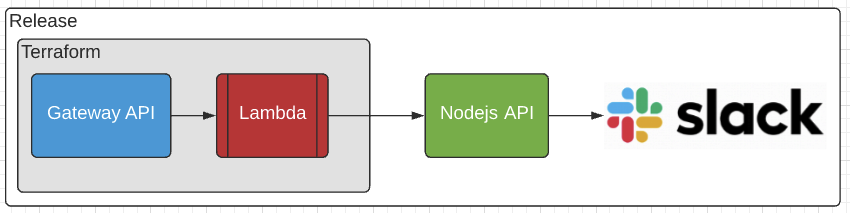
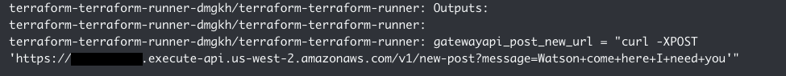

# Terraform

This project demonstrates the usage of Terraform on Release. It handles the creation of an AWS Gateway API and Lambda function that forwards all requests to a dockerized Node.js API where it is then logged.



To make this project run in [Release](https://releaseapp.io), simply create a new application with this repository, and follow the instructions below when creating the application template.

# Application Template Setup

In the `services` section inside the application template, add a service for the terraform script. Ensure that `image` and `build.context` point to the directory where terraform and its dockerfile live:

```
...
services:
- name: terraform
  image: awesome-release/terraform-demo/terraform
  build:
    context: terraform/
  has_repo: true
  static: false
  command:
  - "/bin/sleep"
  - infinity
...
```

Below the services section, add a `jobs` section with a job to run the terraform script. Make sure the `from_services` field points to the service `name` created from the previous step:

```
...
jobs:
- name: terraform-runner
  completed_timeout: 1800
  from_services: terraform
  args:
  - apply -auto-approve
...
```

Lastly, modify the `workflows` section and add the job that was created in the previous step:

```
...
workflows:
- name: setup
  order_from:
  - jobs.terraform-runner
  - services.terraform
  - services.backend
- name: patch
  order_from:
  - jobs.terraform-runner
  - services.backend
...
```

# Environment Variables

Copy the following env variables and fill in values as necessary.

```
...
services:
  backend:
  - key: NODE_ENV
    value: production
  - key: PORT
    value: '3000'
  # Set to 0 to disable slack messaging.
  - key: SLACK_ACTIVE
    value: 1
  - key: SLACK_TOKEN
    value: <slack token>
  - key: SLACK_CHANNEL_ID
    value: <channel id>
  terraform:
  - key: AWS_REGION
    value: us-west-2
  - key: TF_VAR_tld_name
    value: <tld name>
  - key: TF_VAR_certificate_arn
    value: <aws:acm:cert>
  - key: TFAWS_ROLE_ARN
    value: <aws:iam:role>
  - key: TFSTATE_BUCKET
    value: <bucket name>
  - key: TFSTATE_BUCKET_REGION
    value: <bucket region>
mapping:
  TF_VAR_env_id: "${RELEASE_ENV_ID}"
  TF_VAR_backend_ingress_url: "${BACKEND_INGRESS_URL}"
...
```

After these changes are made, you are ready to deploy!

# Expected result

Upon successful deployment, there should be 4 instances in the `details` tab of your environment:


- backend - This is the node api.
- health-checker - Regular Docker container health checker.
- terraform - This container is the context for the runner. The terminal can be used to interact with Terraform and tear down the created AWS resources, among other things.
- terraform-runner - This is the terraform script job.

The terraform-runner instance will output the URL of the Gateway API in the logs:



You can then curl it with a POST request like so:

`curl -X POST "https://<app id>.execute-api.<region>.amazonaws.com/v1/new-post?message=Watson+come+here+I+need+you"`

The request will trigger the lambda function and make a request to the node api. You can verify this by checking the backend logs for your message, and slack if you have enabled it in the env config:


