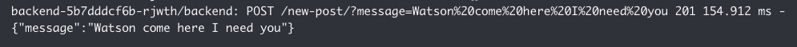

# Terraform

This project demonstrates the usage of Terraform on Release. It handles the creation of an AWS Gateway API and Lambda function that forwards all requests to a dockerized Node.js API where it is then logged.


To make this project run in [Release](https://releaseapp.io), simply create a new application with this repository, and follow the instructions below when creating the application template.

# Application Template Setup

In the `services` section inside the application template, add a service for the terraform script. Ensure that `image` and `build.context` point to the directory where terraform and its dockerfile live:

```
...
services:
- name: terraform
  image: awesome-release/terraform-demo/terraform
  build:
    context: terraform/
  has_repo: true
  static: false
...
```

Below the services section, add a `jobs` section with a job to run the terraform script. Make sure the `from_services` field points to the service `name` created from the previous step:

```
...
jobs:
- name: terraform-runner
  completed_timeout: 1800
  from_services: terraform
  args:
  - apply -auto-approve
...
```

Lastly, modify the `workflows` section and add the job that was created in the previous step:

```
...
workflows:
- name: setup
  order_from:
  - jobs.terraform-runner
  - services.backend
- name: patch
  order_from:
  - jobs.terraform-runner
  - services.backend
...
```

After these changes are made, you can deploy the environment.

# Expected result

Upon successful deployment, there should be 3 instances in the `details` tab of your environment:


The Terraform script will output the URL of the Gateway API in the logs:


You can then curl it with a POST request like so:

`curl -X POST "https://<app id>.execute-api.<region>.amazonaws.com/v1/new-post?name=Bob&message=Hello"`

It will then trigger the lambda function and make a request to the node api. You can verify this by checking the backend logs for your message:


